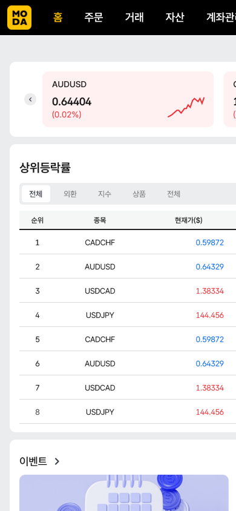

# SOL 디지털 월렛 화면 매핑

각 화면의 라우트, 주요 컴포넌트, 캡처 이미지를 한눈에 확인할 수 있도록 정리했습니다.

## 1. MY홈

- 경로: `/`
- 컴포넌트: `MyHomeScreen`
- 파일: `apps/mobile/src/components/MyHomeScreen.tsx`
- 스크린샷  
  

## 2. 전체 메뉴

- 경로: `/menu`
- 컴포넌트: `GlobalMenuScreen`
- 파일: `apps/mobile/src/components/GlobalMenuScreen.tsx`
- 스크린샷  
  

## 3. SOL 디지털 월렛

### 3-1. 월렛 메인 (자산 대시보드)

- 경로: `/wallet`
- 컴포넌트: `WalletDashboard`
- 파일: `apps/mobile/src/components/WalletDashboard.tsx`
- 스크린샷  
  

### 3-2. 월렛 01. 초기 화면 (시작하기)

- 경로: `/wallet/start`
- 컴포넌트: `WalletWelcome`
- 파일: `apps/mobile/src/components/WalletWelcome.tsx`
- 스크린샷  
  

### 3-3. 월렛 02. 자산 선택

- 경로: `/wallet/asset`
- 컴포넌트: `WalletAssetSelection`
- 파일: `apps/mobile/src/components/WalletAssetSelection.tsx`
- 스크린샷  
  

### 3-4. 월렛 03. 네트워크 선택

- 경로: `/wallet/network`
- 컴포넌트: `WalletNetworkSelection`
- 파일: `apps/mobile/src/components/WalletNetworkSelection.tsx`
- 스크린샷  
  

### 3-5. 월렛 04. 지갑 생성 완료

- 경로: `/wallet/creation-complete`
- 컴포넌트: `WalletCreationComplete`
- 파일: `apps/mobile/src/components/WalletCreationComplete.tsx`
- 스크린샷  
  

## 4. USDC 입금 플로우

| 단계                       | 경로                      | 컴포넌트               | 파일                                                  |
| -------------------------- | ------------------------- | ---------------------- | ----------------------------------------------------- |
| 입금 01. MetaMask 연결하기 | `/deposit/connect-wallet` | `DepositConnectWallet` | `apps/mobile/src/components/DepositConnectWallet.tsx` |
| 입금 02. 금액 입력         | `/deposit/amount`         | `DepositAmountEntry`   | `apps/mobile/src/components/DepositAmountEntry.tsx`   |
| 입금 03. 입금 진행 중      | `/deposit/processing`     | `DepositProcessing`    | `apps/mobile/src/components/DepositProcessing.tsx`    |
| 입금 04. 입금 완료         | `/deposit/completion`     | `DepositCompletion`    | `apps/mobile/src/components/DepositCompletion.tsx`    |

- 스크린샷  
    
    
    
    
  

## 5. USDC 출금 플로우

| 단계           | 경로          | 컴포넌트          | 파일                                             |
| -------------- | ------------- | ----------------- | ------------------------------------------------ |
| 지갑 대시보드  | `/wallet`     | `WalletDashboard` | `apps/mobile/src/components/WalletDashboard.tsx` |
| USDC 출금 화면 | `/withdrawal` | `UsdcWithdrawal`  | `apps/mobile/src/components/UsdcWithdrawal.tsx`  |

## 6. USDC 환전

| 단계               | 경로                   | 컴포넌트             | 파일                                                |
| ------------------ | ---------------------- | -------------------- | --------------------------------------------------- |
| USDC 환전          | `/usdc-exchange`       | `UsdcExchangeFlow`   | `apps/mobile/src/components/UsdcExchangeFlow.tsx`   |
| 디지털자산거래내역 | `/transaction-history` | `TransactionHistory` | `apps/mobile/src/components/TransactionHistory.tsx` |

## 7. 토큰 증권 거래

### 5-1. 토큰 증권 메인 (인기/관심/보유)

- 경로: `/token-securities`
- 컴포넌트: `TokenSecuritiesOverview`
- 파일: `apps/mobile/src/components/TokenSecuritiesOverview.tsx`
- 스크린샷  
  

### 5-2. 라일락(LILAC) 상세 (거래하기)

- 경로: `/token-securities/lilac`
- 컴포넌트: `TokenSecuritiesLilac`
- 파일: `apps/mobile/src/components/TokenSecuritiesLilac.tsx`
- 스크린샷  
  

## 8. 라일락-IU (매수 주문)

- 경로: `/token-securities/lilac/trade`
- 컴포넌트: `TokenTradingOrder`
- 파일: `apps/mobile/src/components/TokenTradingOrder.tsx`
- 스크린샷  
  
